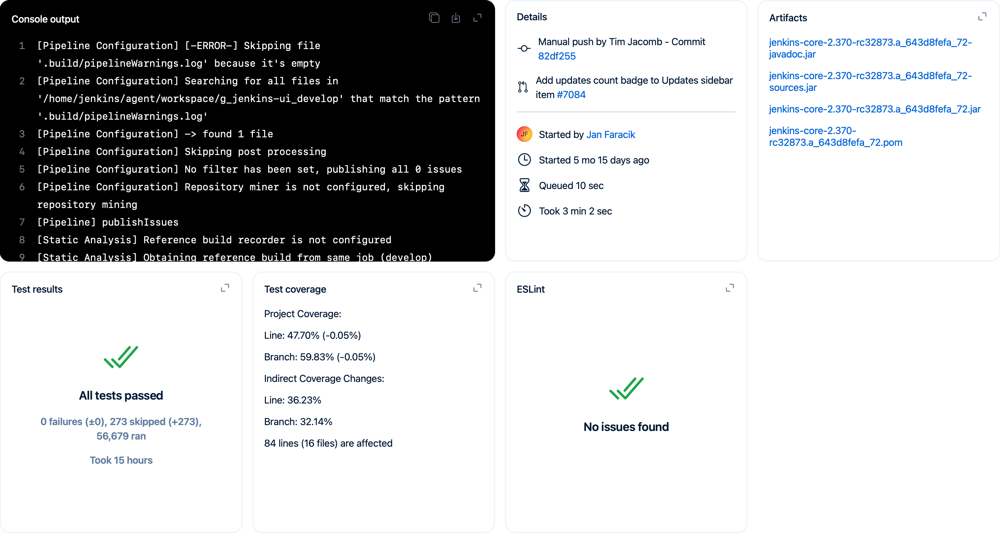

# Cards

Use cards to surface related information and controls to users.

## Background

Currently, the job and build screens display a large amount of information that takes up significant vertical space while utilizing little horizontal space. The existing summary items lack visual appeal, consistency, and the ability to convey detailed information at a glance.

Additionally, the sidebars are often cluttered with numerous, sometimes redundant, links, which can be overwhelming/hard to navigate.

## Proposal

The proposal is to implement a new cards/widgets system for Jenkins (see https://jenkins-redesign.vercel.app/project/build/375). This aims to address the above issues by organizing key features and actions into customizable, modular components. This will not only make the interface cleaner and more intuitive but also provide a more consistent and informative visual summary for users at all levels.

The new card system will automatically resize to different screen sizes, from the smallest to the largest. The cards will be more visual and capable of displaying more information. They will have a consistent set of components that can be reused, with the flexibility for developers to add their own. Each card can feature a uniform action row in the top right corner, providing a consistent user experience. The cards will be interactive, expandable, and customizable, allowing developers to tailor the interface to their specific needs and preferences.

### The 'Details' card

The 'Details' card is a reusable card for displaying glancable information about an item (currently in the prototype it's implemented for jobs and builds - but it could be added for nodes and users too etc). 

It'll be extensible by developers too, for example, GitHub integration could highlight the branch or pull request that was ran, as well as the latest commit information which triggered that build.

## Questions

> Should the widgets be of fixed size or do we have a grid where a widget can fill 1x1, 2x1, or whatever number of cells?

Current thinking for MVP is no due to complexities of ordering/adjusting for different screen resolutions.

> Can we rearrange the widgets?

For an MVP I don't think so, but it's definitely something that'd be interesting for the future.

> Can we customize the appearance (order, visibility, size, color)?

Yes to all of the above.

Developers should be able to define priorities for their cards, e.g. the pipeline graph view or console would probably take highest priority.

Visibility, size and color should all be customizable too - e.g. the console view could follow your text editor theme.

> Does the layout adapt to different screen sizes automatically?

Yes, cards and their contents should scale to different screen sizes.

> How would X look in this format?

If you're curious about how a certain feature might look, let me know and I'll prototype something :)
