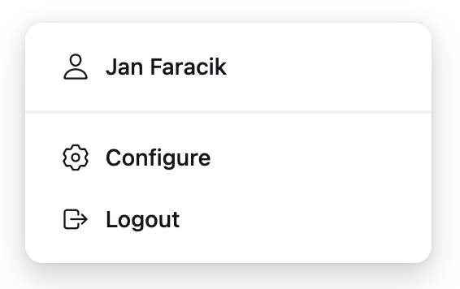

# Navigation

A new navigation model for Jenkins.

## Background

...

See the [prototype](https://jenkins-redesign.vercel.app) for an idea of what it might look like.

## Proposal

The proposal is to implement a new 

### Jumplists

When you hover over an item in the navigation bar a tooltip will appear, showing the name of the item.

In some scenarios a menu will appear, such as when you hover over the 'User' item:

This will be customizable by developers, for example, the 'Favourites' plugin could display a user's favourited items, so that they're always accessible.

### Responsive

### Notifications

## Questions

TBC
